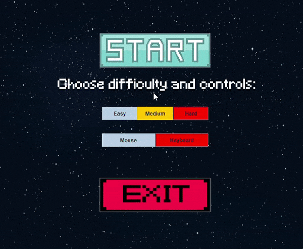

# Brick Breaker

### Info
Brick breaker project game. Fake version of the brick breaker There are 2 type of power ups currently in the game.
   * Increase of the paddle width.
   * Fireball - making the ball go through the block and killing them.

### Controls

You can play it with your mouse or your keyboard arrows. You have the option in the main menu(I suggest to use the mouse). 

Press SPACE or LEFT MOUSE BUTTON to shoot the ball.

Press ESC to exit to main menu at any time of the game.

Press ENTER to restart the game.

### **Installation**

This is the first version of Brick Breaker.
There is little installation process that need to be done!
1. Download the files from [here](https://drive.google.com/file/d/1eRDj__mLumjSbL-ep1ljQ4JdYzrZvkzW/view?usp=sharing) or download the zip file in the repository.
2. Extract the .zip file.
    * For Windows run "brick-breaker.exe".
    * For MacOS run "brick-breaker.jar" (need to have JDK/JRE)
3. Enjoy!
---

### License
This project is not licensed under any license organisation :(